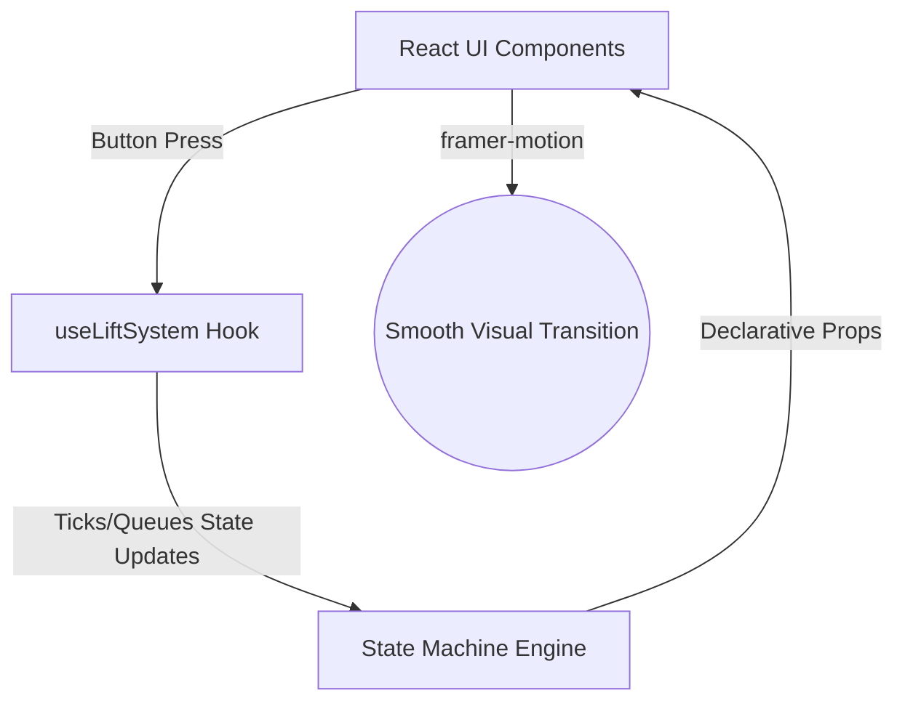

# Idiomatic React Redesign: Lift Simulation Blueprint

This document details the architectural plan to refactor the Lift Simulation codebase into idiomatic React. It explains the design flaws of the current system, introduces a robust, declarative architecture, and provides step-by-step implementation instructions.

---

## ⚠️ Current Architecture vs. Idiomatic React

The current codebase operates as a **Callback-Driven Physical Simulator**. The table below compares the current approach with standard React best practices:

| Concept | Current Approach | Idiomatic React |
| :--- | :--- | :--- |
| **State Machine Drive** | Driven by Framer Motion's `onAnimationComplete` callbacks. If animations are skipped, the simulation halts. | Driven by a centralized timer interval, tick engine, or promise-based queue in React Hooks. |
| **Component Reconciliation** | Forces unmounting and remounting by constantly changing the component's `key`. | Components persist; React is allowed to reconcile changes natively, using CSS/Framer Motion to smoothly transition states. |
| **Visual Position** | Calculated in absolute coordinates and animated with custom step offsets. | Declaratively derived from the logical floor position (e.g., `top = currentFloor * floorHeight`). |
| **Control Flow** | Distributed across `Controller`, `signalReceiver.ts`, and `LiftBox.tsx`. | Orchestrated inside a custom React hook (e.g., `useLiftSystem.ts`). |

---

## 🏗️ Proposed Architecture

The new architecture decouples **Simulation Logic** from **Presentation**.



### 1. The Logical Lift State Model
In the idiomatic model, state variables are deterministic and update at discrete time intervals.

```typescript
export interface Lift {
    id: number;
    currentFloor: number;      // Actual/fractional floor position
    targetFloor: number | null; // Next immediate floor destination
    direction: "UP" | "DOWN" | "IDLE";
    doorState: "CLOSED" | "OPENING" | "OPEN" | "CLOSING";
    queue: number[];           // Floors scheduled for this lift
}
```

---

## 🛠️ Step-by-Step Refactoring Plan

### Step 1: Create the Central State Orchestrator (`useLiftSystem.ts`)
Instead of distributing transitions, write a hook that manages the lifecycles of all elevators using simple timeouts or simulation tick intervals.

```typescript
// src/hooks/useLiftSystem.ts
import { useState, useEffect } from "react";

export const useLiftSystem = (numLifts: number, numFloors: number) => {
    const [lifts, setLifts] = useState<Lift[]>([]);
    const [calls, setCalls] = useState<boolean[][]>([]); // Outer button panels

    // Core simulation tick
    useEffect(() => {
        const interval = setInterval(() => {
            setLifts(prevLifts => prevLifts.map(lift => {
                // 1. If moving, increment/decrement currentFloor towards targetFloor
                // 2. If reached target, set doorState to "OPENING" and pause ticks for that lift
                // 3. Clear serviced calls from the global queue
                return updateLiftLogic(lift);
            }));
        }, 100); // 100ms simulation tick rate

        return () => clearInterval(interval);
    }, []);

    const callLift = (floor: number, direction: "UP" | "DOWN") => { ... };

    return { lifts, calls, callLift };
};
```

### Step 2: Refactor components to be Purely Declarative

#### 1. Refactor `LiftContainer.tsx`
Remove the key mutation. Let React reuse the DOM nodes:
```diff
- key={JSON.stringify(newValue) + JSON.stringify(index) + JSON.stringify(item)}
+ key={lift.id}
```

#### 2. Refactor `LiftBox.tsx` to be Purely Presentation
Instead of handling custom state updates, let it simply render what is requested by the hook:
```typescript
interface Props {
    currentFloor: number;
    doorState: "CLOSED" | "OPENING" | "OPEN" | "CLOSING";
    direction: "UP" | "DOWN" | "IDLE";
}

const LiftBox = ({ currentFloor, doorState, direction }: Props) => {
    // Top offset calculated declaratively
    const topPosition = (totalFloors - currentFloor) * floorHeight;

    // Door width determined by doorState prop directly
    const doorWidth = doorState === "CLOSED" ? "50%" : doorState === "OPEN" ? "0%" : ...;

    return (
        <motion.div
            animate={{ top: topPosition }}
            transition={{ type: "tween", ease: "easeInOut" }}
        >
            {/* Left and Right sliding doors with transition bindings */}
        </motion.div>
    );
};
```

### Step 3: Implement an Clean Multi-Lift Cost Function
Since `cRF.ts` is currently recursive and simulates states manually, it can be refactored into a simple linear cost calculation function:

$$\text{Cost} = \text{Distance} + \text{Directional Penalty} + \text{Queue Stop Penalty}$$

```typescript
export const calculateAllocationCost = (lift: Lift, targetFloor: number, direction: "UP" | "DOWN"): number => {
    let cost = Math.abs(lift.currentFloor - targetFloor);

    // Add penalty if the lift is moving in the opposite direction
    if (lift.direction === "UP" && targetFloor < lift.currentFloor) cost += 5;
    if (lift.direction === "DOWN" && targetFloor > lift.currentFloor) cost += 5;

    // Add penalty for each stop already queued
    cost += lift.queue.length * 2;

    return cost;
};
```

---

## 📈 Outcome and Benefits
By executing this plan:
1. **Robustness**: The app won't freeze when window visibility drops or when CSS animations fail to fire.
2. **Performance**: Rendering becomes smooth as React bails out of redundant unmounts/remounts.
3. **Extendability**: Adding internal elevator buttons (inside cabin selectors) becomes trivial because the queues are standard JavaScript arrays.
